# 初めに

## Gitとは

Gitは、分散型バージョン管理システムの一つです。

バージョン管理システムとは、ファイルの変更履歴を管理するためのシステムです。
Gitを使うことで、ファイルの変更履歴を管理し、過去の状態に戻したり、複数人での開発を行う際にお互いの変更を統合することができます。

## Gitのインストール
https://git-scm.com/

Downloadsを押す
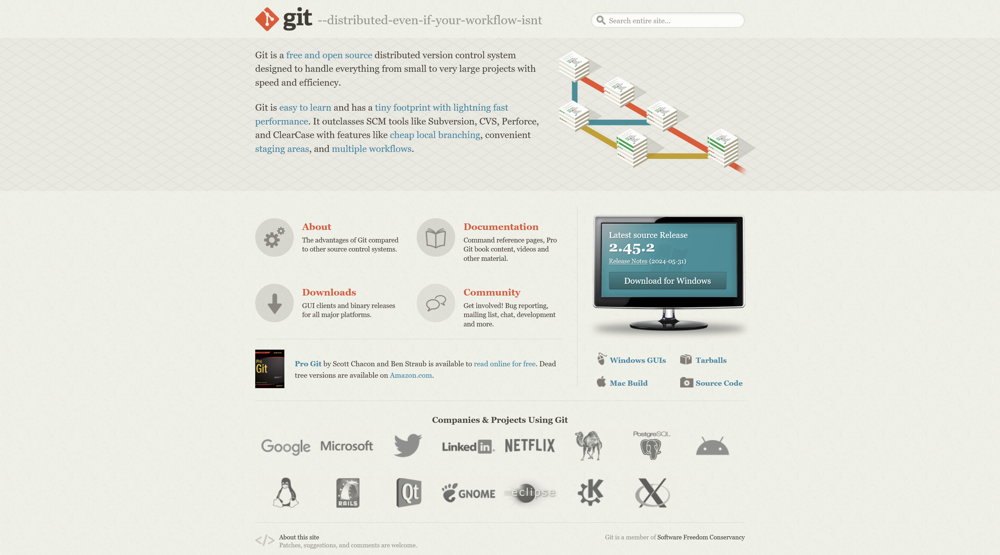

windowsを選択
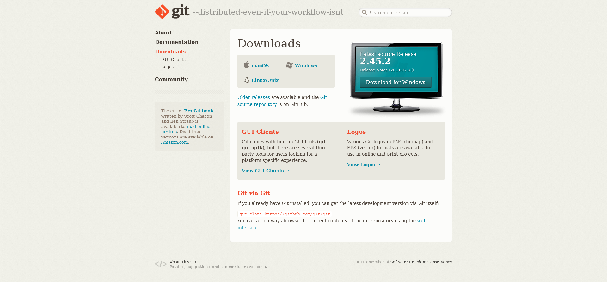

Click here to downloadを押す

Nextで進む
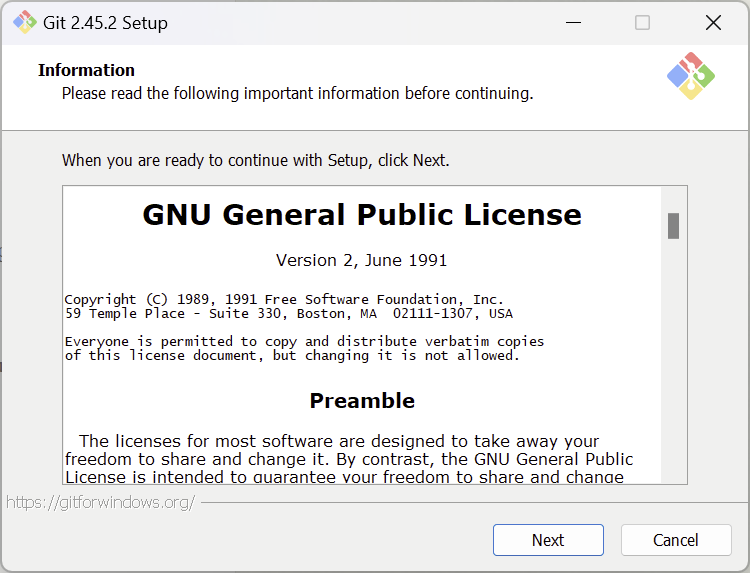

Nextで進む
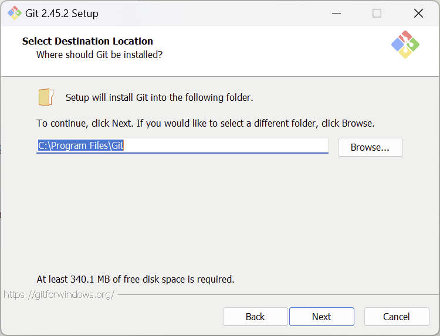

以下の画面となるので、ここで(NEW!) Add a Git Bash Profile to Windows Terminalを押す
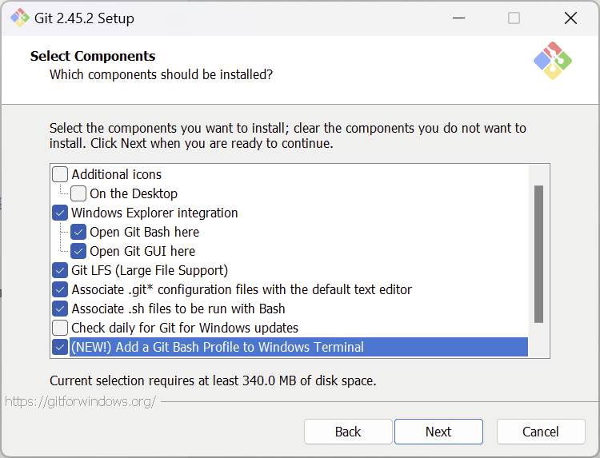

Nextで進む
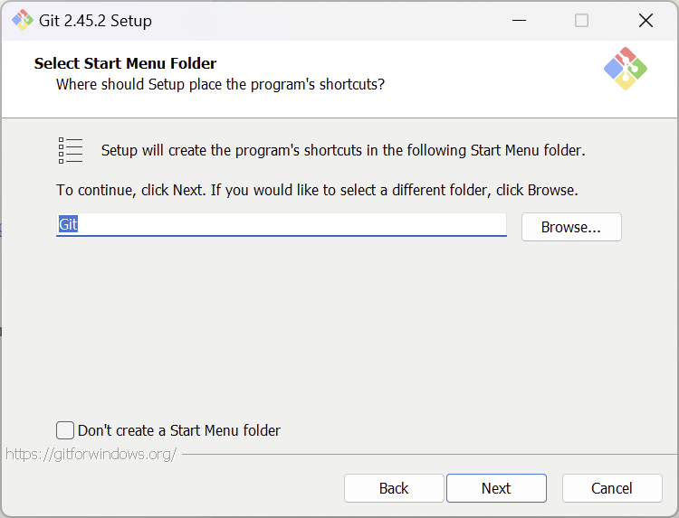

Use Visual Studio Code as Git's default editorを選択
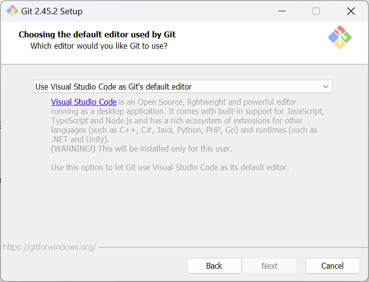

Let Git decideを選択
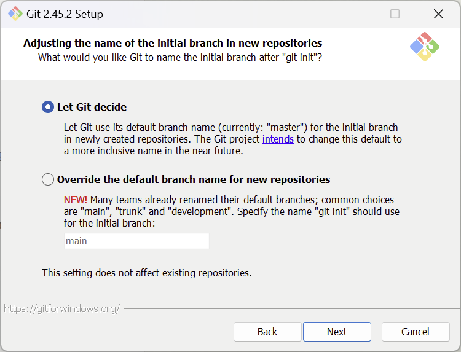

以下の画面でGit from the command line and also from 3rd-party softwareであることを確認
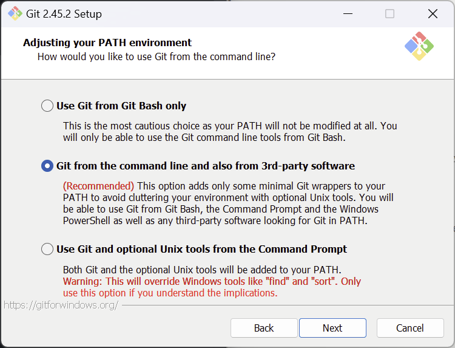

Use bundled OpenSSHを選択
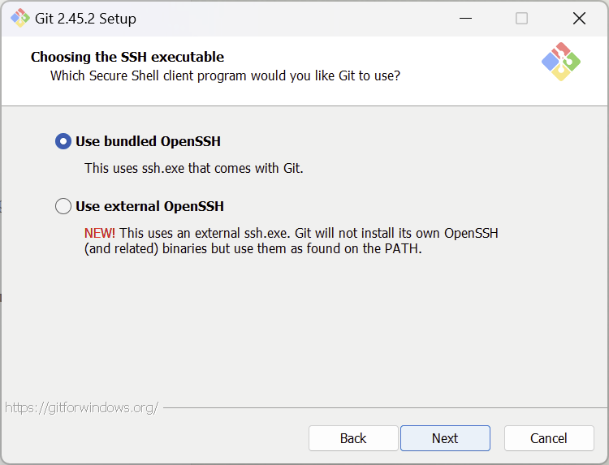

Use the OpenSSL Libraryを選択
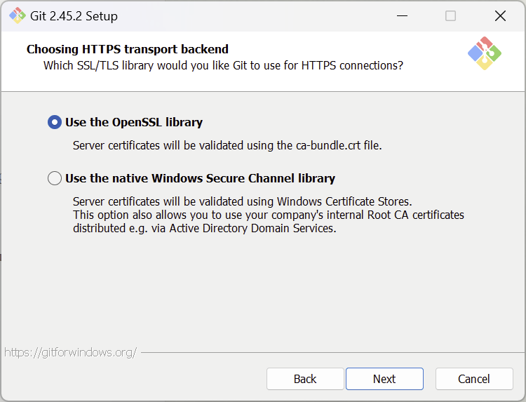

Checkout Windows-style, commit Unix-style line endingsを選択
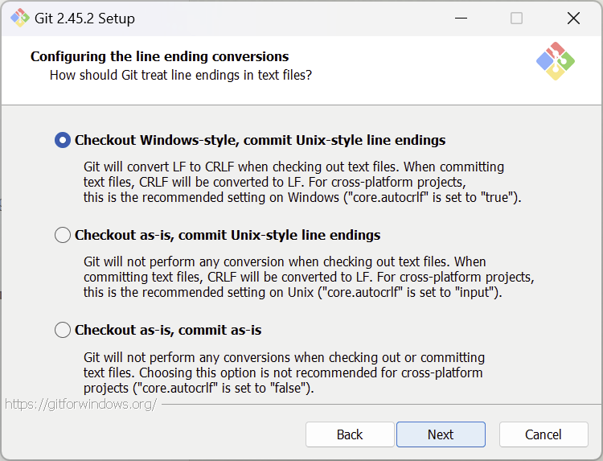

Use MinTTYを選択
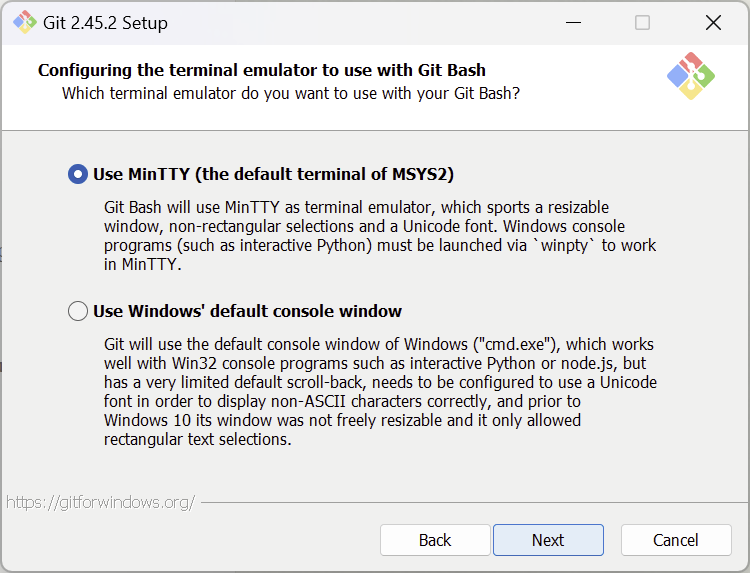

Fast-forward or mergeを選択
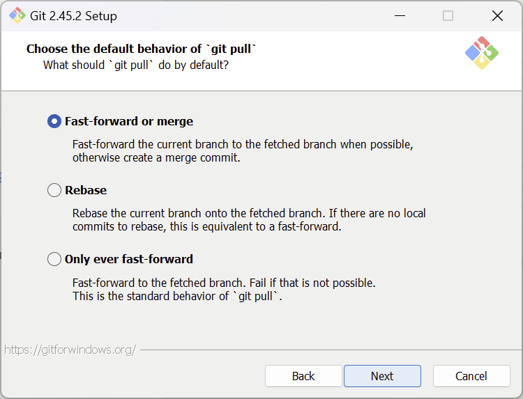

Enable file system cachingを選択
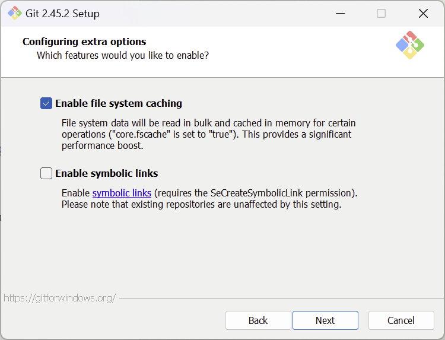

特に設定せずInstallを押す。
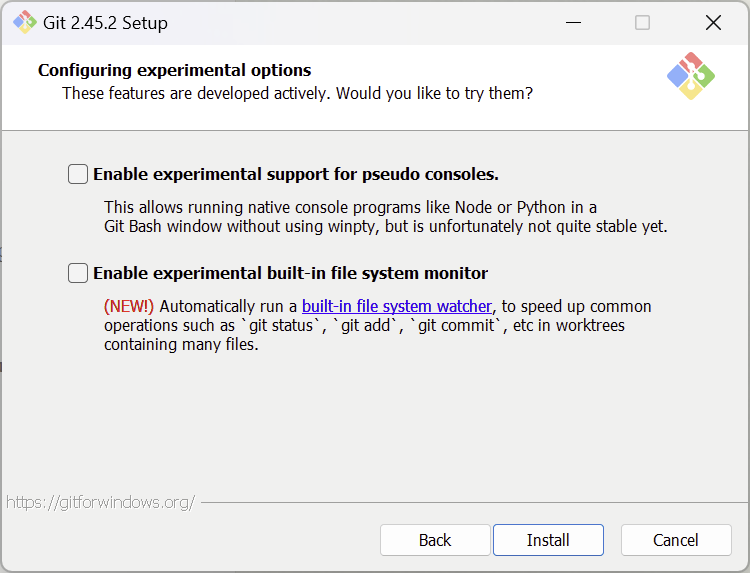

ダウンロードが開始するので、完了したら、
コマンドプロンプトで`git version`を打って動作することを確認

## GitHubのアカウント作成
[GitHub](https://github.com)から進める
