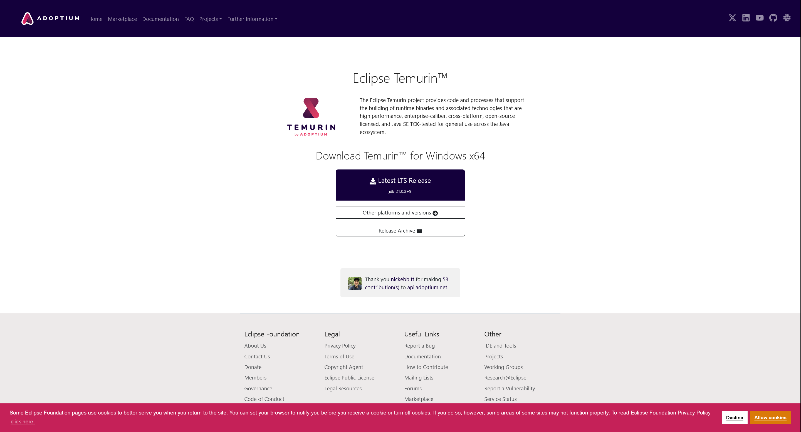
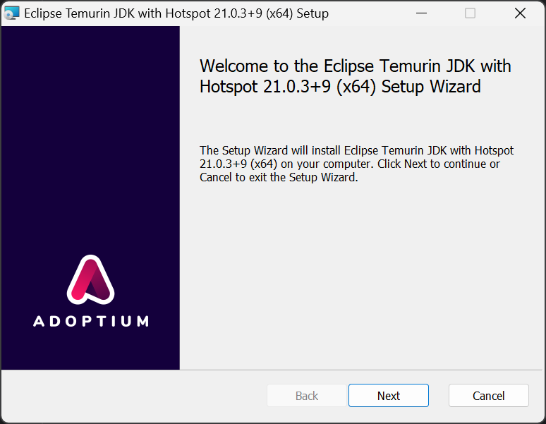

# 初めに
このドキュメントは、Java Development Kit(JDK)のインストール方法について説明します。

# JDKのインストール
[Eclipse Temurin](https://adoptium.net/temurin/)を使用してJDKをインストールします。

基本的には最初のページに出てくるLatest LTS Releaseを選択してダウンロードします。



もし、バージョン等を変更したい場合は、[Download](https://adoptium.net/releases.html)から選択します。

# インストール


Set JAVA_HOME variableを選択して、Nextをクリックしインストールします。


# 確認

インストールが完了したら、コマンドプロンプトを開いて、以下のコマンドを実行します。
```cmd
java --version
```

以下のように表示されれば、インストールが完了しています。
```cmd
$ java --version
openjdk 21.0.3 2024-04-16 LTS
OpenJDK Runtime Environment Temurin-21.0.3+9 (build 21.0.3+9-LTS)
OpenJDK 64-Bit Server VM Temurin-21.0.3+9 (build 21.0.3+9-LTS, mixed mode, sharing)
```

