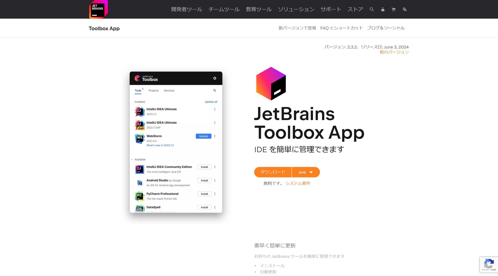
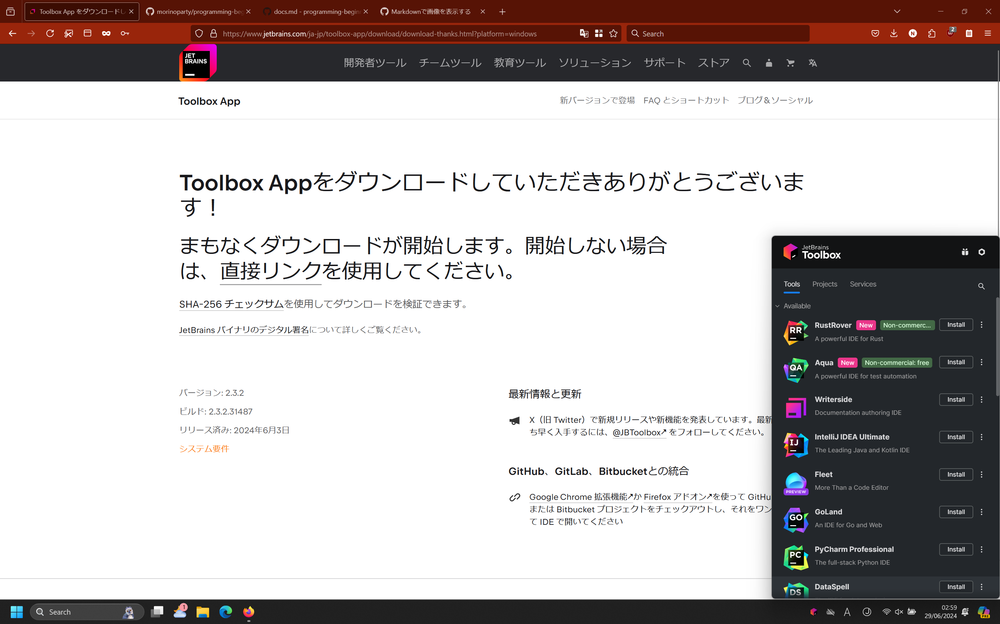
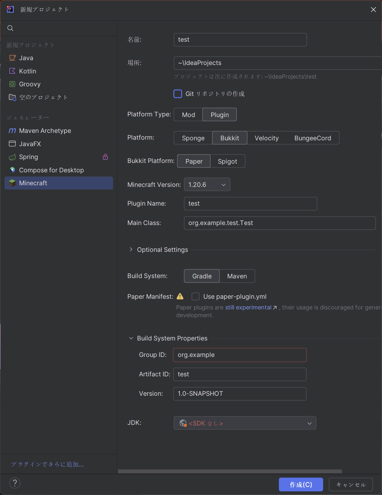

# 環境構築
## Intellij IDEAのインストール
Intellij IDEAをインストールするために、[JetBrains Tool Box](https://www.jetbrains.com/ja-jp/toolbox-app/)をインストールします。

ダウンロードした後、実行したのち、右下のほうにポップアップが出てくるので、そのまま進めてください。

その後以下の画像のようなポップアップとなるので、Intellij IDEA Community Editionを探してください。

> [!WARNING]
> Intellij IdeaにはCommunity版とUltimate版があるのでCommunity版を選択してください。

## Pluginのインストール

ダウンロードが完了したら、次の画像のプラグインというところを選択します。

そこで以下のプラグインをダウンロードします。
- Japanese Language Pack
- Minecraft Development(こちらの選択時に警告ができるが無視して進める)

ダウンロードが完了したら、Intellij IDEAを再起動します。

## プロジェクトを始める

再起動が完了したら、スタート画面にあ新規プロジェクトを押します。

新規プロジェクトを押したら、左側のジェネレーターのところにあるMinecraftを選択します。

そうしたら、それぞれのフィールドを選択していきます。 

- 名前: `test`等好きな名前を選択してください。
-  場所: そのままで結構です。 
- Platform Type: 今回はプラグインを作成するので、`Plugin`を選択してください。
- Platform : `Bukkit`を選択。
- Bukkit Platform: `paper`を選択。
- Minecraft Version: 作成したいバージョンを選択してください。今回は`1.20.6`で進めていきます。
- Plugin Name: 適当な名前を選択します。(CamelCaseで記入してください[^1])今回は`test`としておきます。
- Main Class: この後の入力で自動的に変化するため変更しないでください。

[^1]: CamelCaseとは、単語の区切りを大文字とするのもです。例: mechanical pencilであればMechanical Pencilとします。

次にOptional Settingというところに行きます。
- Build System: `Gradle`を選択。
- Paper Manifest: チェックなしで進めます。

その後、Build System Propertiesに進みます。

- Group ID : ドメインを逆にしたものを使います。example.comだったらcom.exampleといった形。今回はgithubのアカウントのドメインを逆にしたものを使用するため、`com.github.<userName>`とします。例: `com.github.nlkomaru`
- Artifact ID: 適当な名前を選択します。(英小文字で区切りをしたいときはハイフンを利用してください)今回は`test`としておきます。
- Version: そのままでかまいません。

最後にJDKというところをの設定をします。クリックをしていただくとJDKのダウンロードという項目が出てきます。そこを押していただき、出てきたポップアップの、
- バージョン: `21`
- ベンダー: `Eclipse Temurin (AdoptOpenJDK HotSpot)`
- 場所: `変更なし`

を選択しダウンロードを押します。

ダウンロードが完了したら作成ボタンを押します。

