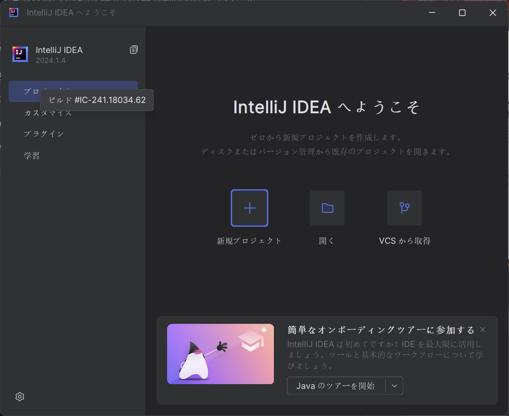

# プラグインを作ってみよう(イベント) 
## プロジェクトを作ってみよう

スタート画面に新規プロジェクトを押します。



新規プロジェクトを押したら、左側のジェネレーターのところにあるMinecraftを選択します。


そうしたら、それぞれのフィールドを選択していきます。<br>

- 名前: `test-event`等好きな名前を選択してください。
-  場所: そのままで結構です。
- Platform Type: 今回はプラグインを作成するので、`Plugin`を選択してください。
- Platform : `Bukkit`を選択。
- Bukkit Platform: `paper`を選択。
- Minecraft Version: 作成したいバージョンを選択してください。今回は`1.21`で進めていきます。
- Plugin Name: 適当な名前を選択します。(CamelCaseで記入してください[^1])今回は`test-event`としておきます。
- Main Class: この後の入力で自動的に変化するため変更しないでください。

[^1]: CamelCaseとは、単語の区切りを大文字とするのもです。例: mechanical pencilであればMechanical Pencilとします。

次にOptional Settingというところに行きます。
- Build System: `Gradle`を選択。
- Paper Manifest: チェックなしで進めます。

その後、Build System Propertiesに進みます。

- Group ID : ドメインを逆にしたものを使います。example.comだったらcom.exampleといった形。今回はgithubのアカウントのドメインを逆にしたものを使用するため、`com.github.<userName>`とします。例: `com.github.nlkomaru`
- Artifact ID: 適当な名前を選択します。(英小文字で区切りをしたいときはハイフンを利用してください)今回は`test`としておきます。
- Version: そのままでかまいません。

最後にJDKというところをの設定をします。クリックをしていただくとJDKのダウンロードという項目が出てきます。そこを押していただき、出てきたポップアップの、
- バージョン: `21`
- ベンダー: `Eclipse Temurin (AdoptOpenJDK HotSpot)`
- 場所: `変更なし`

を選択しダウンロードを押します。

ダウンロードが完了したら作成ボタンを押します。

## 初期設定

プロジェクトが作成されたら、IntelliJ IDEAを開きます。
様々なファイルがあると思いますが、build.gradleを開いてください。

```diff
plugins {
    id 'java'
+   id 'xyz.jpenilla.run-paper' version "2.3.0"
}
```

このように、pluginsのところに、`id 'xyz.jpenilla.run-paper' version "2.3.0"`を追加してください。

次に、一番下に、
```groovy
tasks{
    runServer {
        minecraftVersion("1.21")
    }
}
```
を追加してください。

## プラグインの作成

まず、src/main/java/com/github/<username>/testevent/Test_Event.javaを開きます

```java
public final class Test_event extends JavaPlugin {

    @Override
    public void onEnable() {
        // プラグインが有効になったときの処理
    }

    @Override
    public void onDisable() {
        // プラグインが無効になったときの処理
    }
}
```

初めは、このような形になっていると思います。

プラグインのクラスを外部から参照できるようにするために、Test_eventクラスにstaticな変数を追加します。

```java
public final class Test_event extends JavaPlugin {
    private static Test_event plugin;

    @Override
    public void onEnable() {
        // プラグインが有効になったときの処理
        plugin = this;
    }

    @Override
    public void onDisable() {
        // プラグインが無効になったときの処理
    }

    public static Test_event getPlugin() {
        return plugin;
    }
}
```


この中に、イベントを追加していきます。
イベントの追加は、onEnableの中に追加していきます。

```java
@Override
public void onEnable() {
    // プラグインが有効になったときの処理
    getServer().getPluginManager().registerEvents(new TestListener(), this);
}
```

このように、`getServer().getPluginManager().registerEvents(new TestListener(), this);`を追加してください。

それでは、イベントが実行された時の処理を行うTestListenerを作成していきます。
com.github.<username>.testeventの中にlistenerというパッケージを作成し、その中にTestListener.javaを作成してください。

```java
package com.github.nlkomaru.testevent.listener;

import com.github.nlkomaru.testevent.Test_event;
import org.bukkit.event.EventHandler;
import org.bukkit.event.Listener;
import org.bukkit.event.block.BlockBreakEvent;

public class TestListener implements Listener {
    @EventHandler
    public void onBlockBreakEvent(BlockBreakEvent event) {
        Test_event.getPlugin().getLogger().info("BlockBreakEvent is called!");
    }
}
```

このように、@EventHandlerをつけて、onBlockBreakEventを作成してください。

これでイベントの処理ができるようになりました。

### プラグインの実行

プラグインを実行するために、IntelliJ IDEA上のコンソールで、`.\gradlew runServer`を実行してください。

これで、サーバーが起動し、プラグインが読み込まれます。

サーバーに入り、ブロックを壊すと、コンソールに`BlockBreakEvent is called!`と表示されることを確認してください。

以上で、プラグインの作成が完了しました。

### プレイヤーの情報の取得

プレイヤーの情報を取得するために

```java
@EventHandler
public void onBlockBreakEvent(BlockBreakEvent event) {
    Player player = event.getPlayer(); // プレイヤーの情報を取得
    Test_event.getPlugin().getLogger().info(player.getName() + " broke a block!");
}
```

### ほかにはどんな情報が取得できるのか

ほかの情報を閲覧するには、JavaDocを参照してください。

JavaDocとは、JavaのAPIのドキュメントのことです。JavaのAPIには、様々なクラスやメソッドがありますが、それらの説明が書かれています。
今回は、Paper MCのAPIを参照しているので、Paper MCのAPIのJavaDocを参照してください。

PaperMCのJavaDoc: https://jd.papermc.io/paper/1.21/

今回利用したBlockBreakEventのJavaDoc: https://jd.papermc.io/paper/1.21/org/bukkit/event/block/BlockBreakEvent.html


これを見ると、BlockEventから継承したgetBlock()というメソッドがあることがわかります。

これを利用して、ブロックの情報を取得することができます。

```java
    @EventHandler
    public void onBlockBreakEvent(BlockBreakEvent event) {
        Player player = event.getPlayer();
        Block block = event.getBlock(); // ブロックの情報を取得
        Test_event.getPlugin().getLogger().info(player.getName() + " broken " + block.getType());
    }
```

これで、ブロックの情報を取得することができます。

### 別のイベント

他にも、様々なイベントがあります。
これについては、先ほどと同様にJavaDocを参照してください。

JavaDoc: https://jd.papermc.io/paper/1.21/

### まとめ

今回は、プラグインの作成とイベントの追加について学びました。

次回は、コマンドの追加について学びます。

## 参考文献

- [PaperMC JavaDoc](https://jd.papermc.io/paper/1.21/)
- [PaperMC BlockBreakEvent](https://jd.papermc.io/paper/1.21/org/bukkit/event/block/BlockBreakEvent.html)
- [PaperMC Player](https://jd.papermc.io/paper/1.21/org/bukkit/entity/Player.html)


