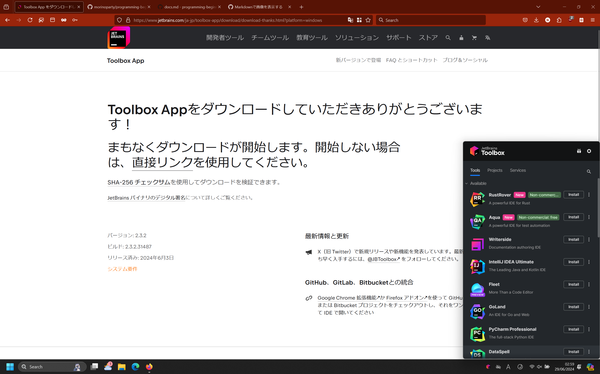
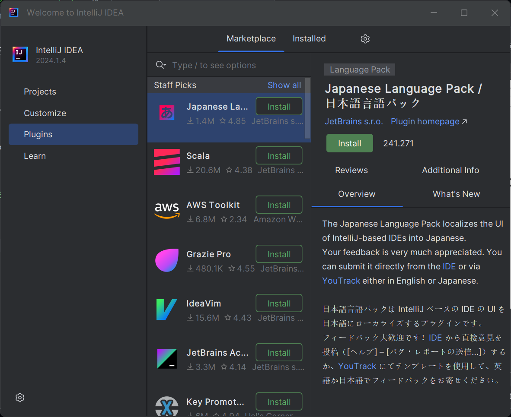

# 環境構築
## Intellij IDEAのインストール
intellij ideaをインストールするために、[JetBrains Tool Box](https://www.jetbrains.com/ja-jp/toolbox-app/)をインストールします。

ダウンロードした後、実行したのち、右下のほうにポップアップが出てくるので、そのまま進めてください。

その後以下の画像のようなポップアップとなるので、Intellij Idea Community Editionを探してください。

> [!WARNING]
> Intellij IdeaにはCommunity版とUltimate版があるのでCommunity版を選択してください。

ダウンロードが完了したら、次の画像のプラグインを選択します。

